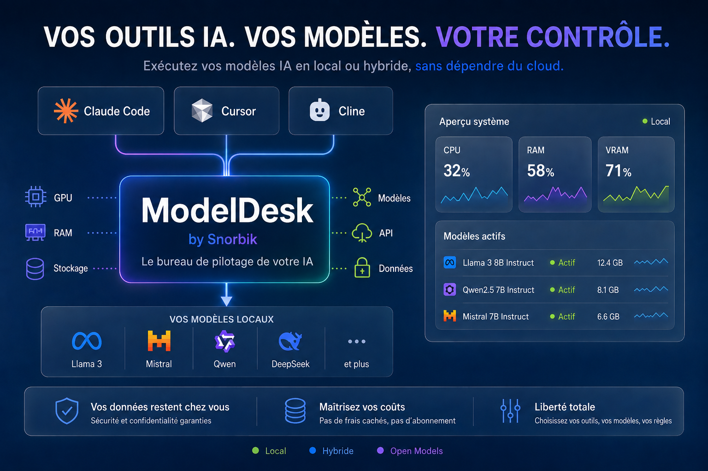

# ModelDesk — Vitrine publique Snorbik

**Vos outils IA. Vos modèles. Votre contrôle.**

> Dossier : [`../modeldesk-vitrine-publique/`](../modeldesk-vitrine-publique/) · GitHub : [snorbik-ai-platform](https://github.com/ta-dev-ai/snorbik-ai-platform)

**📺 [YouTube @SNORBIKStudio](https://www.youtube.com/@SNORBIKStudio)**

---

## Voir la vitrine

| Méthode | Action |
|---------|--------|
| **Local** | Double-clic `OPEN_VITRINE.bat` |
| **Navigateur** | Ouvrir [`index.html`](index.html) — bannière + GIF démo |
| **Web public** | GitHub → **Settings → Pages** → branch `main` → site en ligne |

---

**Code produit (privé ou public) :** [github.com/ta-dev-ai/ModelDesk](https://github.com/ta-dev-ai/ModelDesk)

**Contact :** contact@snorbik.com
