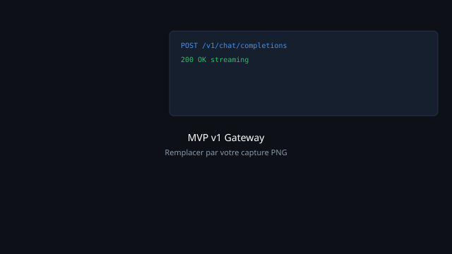
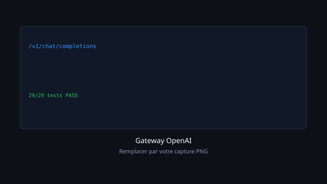
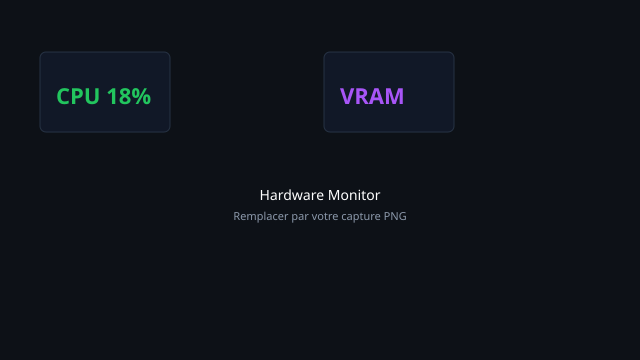
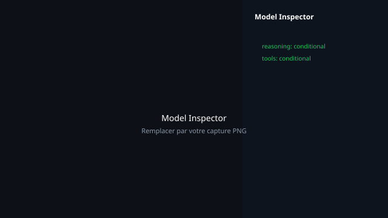

# Plateforme IA locale pour développeurs

**Gateway OpenAI · LLM local (Ollama) · Monitoring GPU · Cursor / VS Code / Codex · Sans dépendance cloud**

Deux MVP d'une plateforme IA souveraine : passerelle locale compatible avec les IDE de développement, supervision matérielle, déploiement multimodal — sans exposer le code source privé.

🌐 **Vitrine en ligne :** [ta-dev-ai.github.io/snorbik-ai-platform](https://ta-dev-ai.github.io/snorbik-ai-platform/)

---

## Démonstration (GIF)


*Enregistrement écran — gateway, modèles locaux et monitoring (août 2026)*

---

## Le problème

- Coûts cloud et dépendance aux API tierces pour le développement IA
- Risque de fuite de code et de données sensibles vers des serveurs externes
- Difficulté à déployer et piloter l'IA locale (LLM, vision, audio) depuis les IDE

---

## Ce qu'on a construit

| MVP | Description |
| --- | ----------- |
| **v1** | Gateway locale + agents MCP + orchestration cloud hybride |
| **v2** | Centre d'infrastructure IA : catalogue modèles, monitoring GPU, gateway unifiée |

---

## Captures d'écran

| MVP v1 — Gateway locale | MVP v2 — Gateway OpenAI |
| --- | --- |
|  |  |

| MVP v2 — Monitoring GPU | MVP v2 — Model Inspector |
| --- | --- |
|  |  |

---

## Technologies

`Python` · `FastAPI` · `IA locale` · `Ollama` · `HuggingFace` · `MCP` · `Monitoring GPU` · `Cursor` · `Codex`

---

## Structure

```
public/
├── index.html          ← vitrine web (GitHub Pages)
├── assets/gifs/        ← démonstrations animées
└── assets/screenshots/ ← captures MVP
```

Code source applicatif : **privé** — ce repo contient uniquement la vitrine publique.
